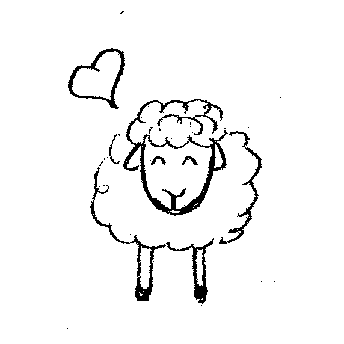

# The Sheep Game (3+ players)

The sheep game is a cooperative game. Everybody wins or everybody loses! The basic idea of the game is best summarised by comparing it with the real world:

**Real life:** you were told we were all born equal, and it is down to you to make your life that incredible source of success and happiness. For some reason, it all didn't quite work out. Your parents were poor, or you had health problems, or you had to look after your siblings and then your own children, or juggle working and studying. Perhaps you struggled to pay your mortgage, your company went bankrupt, you were in emotionally difficult situations. Or simply, your business idea for environmentally-friendly irrigation got less attention than the latest make-your-own-emoticon application. You haven't found success. Happiness is a luxury. And apparently, it's all your fault. (Because we were born equal, remember?)

**The Sheep Game:** let's be realistic. We were not born equal. Neither in terms of resources, neither in terms of needs. And life makes us even more unequal. Still, we can practise living together in a way that we look after each person's happiness. So let's imagine...

## Synopsis 

You're a small group of friends who decide to raise sheep together in a commune. You all come to the project with different means: some of you are richer and own more sheep than others. You also all have various wishes (a chocolate bar, a new bicycle, or a trip to to the Bermuda Triangle...) The goal of the game is to make everybody happy by satisfying their wishes. You decide at the beginning of the game how many years you will spend together on your commune, and you must survive that length of time in order to win the game. But beware: if at the end of any year, someone has more than 2 unfulfilled wishes, you all have lost!

Now, you might think that keeping people happy is easy: you must simply commit to helping each other, and everything will follow. Things are not that simple, though. Despite your best intentions, LIFE interferes with your plans. You will need all your wisdom to stay true to your idea of a better world. And you might learn a few things along the way...

## Advisory

The sheep game includes the gory aspects of sheep holding. Your sheep may get ill and die. Also, while your female lambs will grow to be milk providers, the only source of income coming from your male lambs is meat.

## Setting up the game for the first time

Setting up the game involves a printer and a pair of scissors. Head to the *img* folder and start printing. You will find:

* some sheep currency (MEH) in the *money* folder (you can also just steal cash from another game, preferably a competitive one...) 
* life and wish cards in the *life* and *wishes* directories;
* some male and female sheep in the *farm* directory;
* a ram, a sheep dog and a shelter card, as well as a board called *commons.png*, also in the *farm* directory.

Very importantly, go and find yourself a 'vet' card: for instance, cut someone's picture out of a magazine. The best vet is one that all players like the look of. The reason for this will become obvious in the course of the game.

In addition, get yourselves a 6-sided dice. 

## Rules of the game

Here are some suggestions for how to play the game. You may find that they do not cover all possible situations you will find yourselves in. If you get stuck, practise your democratic skills and decide together how to proceed!

### Beginning of the game

* Each player rolls a dice and picks that many wish cards.
* Each player rolls a dice. Multiply the roll by 100: this is the player's starting capital.
* Each player rolls a dice. This is the number of sheep already owned by that player (all ewes).

You must also buy a ram to breed with your sheep. The ram costs 100 MEH, and all player can contribute to the cost. Put the ram card in the designated slot on the 'commons'. You don't have to buy a sheep dog or a shelter at the beginning of the game. They can be bought later on when you collectively decide it.

The game starts in Autumn and lasts as many years as you have decided. Once the players have their initial allocation of sheep, turn all remaining sheep face down, or put them in a bag.

### Gameplay, per season

In each season, the players go through two phases, playing one after the other in clockwise order:

* Draw a life card and act upon it.
* Buy, sell, redistribute. You can satisfy wishes. You can sell sheep to the bank (a ewe=500, a ram=100). You can redistribute by giving money or sheep to others, or satisfy their wishes. But beware, some
life cards will prevent you from redistributing. You can also collectively decide to buy a sheep dog or a shelter in this phase.

In addition, the following seasons require extra actions:

* **Autumn:** For each adult ewe the player owns, randomly pick one sheep out of the bag and find out whether you will have a new little male or female sheep in Spring. Put this sheep under the ewe: it is not born yet! Then, if you haven't yet done so, roll the die to pick new wish cards. Half of your wish cards are 'open': other players can see them. Half is hidden: they are your secret wishes. If you rolled an odd number, the majority of your cards should be 'open'.
* **Spring:** your lambs are born. They can come out of their mothers' bellies! Spring is also the time you collect money from the bank for the milk you sold. Get 200 MEH per adult ewe with a baby.
* **Summer:** right at the end of the Summer turn, check how many unfulfilled wishes are left on each player's hand. If all have two or less unfulfilled wishes, carry on playing (or win, if this is your
final year!) If a player has three or more unfulfilled wishes, you have lost the game.

To keep track of the season, put a marker in the appropriate position on the 'commons' board.

Very importantly, do respect the order of play, even in the redistribution phase! Players should take their actions in turn, clockwise. Once a player has taken all the actions they wished, they cannot buy / sell / redistribute any further this season.

### Rules associated with life cards

* Illness cards remain active throughout the years. Unless the card instructs the player otherwise, they apply to a healthy sheep randomly chosen out of the player's flock. Ill sheep cannot have lambs. The sheep can be cured by calling the vet (see below).
* Mood cards also remain visible for the duration of the year. They must be displayed in the player's 'active cards' pile.
* Family pressure cards take priority over everything. A player cannot buy or redistribute until they have satisfied their family.

### Rules regarding the vet

* The vet's pronoun is they/them.
* The vet charges 50 MEH per visit and per sheep.
* The vet is great, but not infallible. They will do their best to treat your sheep when called, but fate can interfere. Illness cards are marked with health points (e.g. "health -2"). When the vet visits, a dice should be rolled. If the number on the dice *minus* the number on the card is zero or less, your sheep dies, despite the vet's efforts. The bill must still be paid. 
**Example:** you draw an illness card with "health -2". You call the vet. Rolling the dice gives you a 3. Since 3 - 2 = 1, your sheep lives. If you had rolled a 2 or a 1, the sheep would sadly have died. 

### Price list:

* A ram: 100 MEH
* A ewe: 500 MEH
* A sheep dog: 1500 MEH
* A shelter: 3000 MEH
* Milk: 200 MEH per adult ewe with baby
* A vet's visit: 50 MEH per sheep

