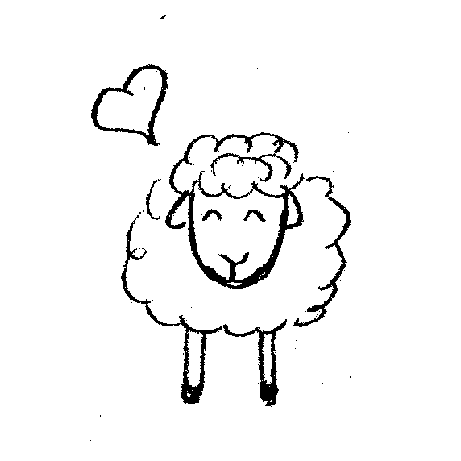

# The Sheep Game

The sheep game is a cooperative game. Everybody wins or everybody loses!

## Synopsis 

**Real life:** you were told we were all born equal, and it is down to you to make your life that incredible source of success and happiness. For some reason, it all didn't quite work out. Your parents were poor, or you had health problems, or you had to look after your siblings and then your own children, or juggle working and studying. Perhaps you struggled to pay your mortgage, your company went bankrupt, you were in emotionally difficult situations. Or simply, your business idea for environmentally-friendly irrigation got less attention than the latest make-your-own-emoticon application. You haven't found success. Happiness is a luxury. And apparently, it's all your fault. (Because we were born equal, remember?)

**The Sheep Game:** let's not kid ourselves. We were not born equal. Neither in terms of resources, neither in terms of needs. But we can practise living together in a way that we look after each person's happiness. So let's imagine...

 
You're a small group of friends who decide to raise sheep together in a commune. At the beginning of the game, you all come to the project with different means: some of you are richer and own more sheep than others. You also all have various wishes (a new bicycle, or a trip to to the Bermuda Triangle...) The goal of the game is to make everybody happy by satisfying their wishes. You decide at the beginning of the game how many years you will spend together on your commune, and you must survive that length of time in order to win the game. But beware: if at the end of any year, someone has more than 2 unfulfilled wishes, you all have lost!

## Setting up the game for the first time

You can print and cut some sheep currency (MEH) from the links in the *money* folder... or just steal some from another game! You can also produce life and wish cards from the relevant directories. In addition, get yourselves a 6-sided die. And... draw some sheep! You'll need little male and little female sheep.

Very importantly, find yourself a vet card: for instance, cut someone's picture out of a magazine.

## Rules of the game

Here are some suggestions for how to play the game. You may find that they do not cover all possible situations you will find yourselves in. If you get stuck, practise your democratic skills and decide together how to proceed!

### Beginning of the game

* Each player rolls a die and picks that many wish cards.
* Each player rolls a die. Multiply the roll by 100: this is the player's starting capital.
* Each player rolls a die. This is the number of sheep already owned by that player (all ewes).

The game starts in Autumn and lasts as many years as you have decided. Once the players have their initial allocation of sheep, turn all remaining sheep face down, or put them in a bag.

### Gameplay, per season

In each season, the players go through two phases, in turn:

* Draw a life card and act upon it.
* Buy, sell, redistribute. You can satisfy wishes. You can sell sheep to the bank (a ewe=500, a ram=100). You can redistribute by giving money or sheep to others, or satisfy their wishes. But beware, some
life cards will prevent you from redistributing. Also, do respect the order of play!

In addition, the following seasons require extra actions:

* **Autumn:** For each adult ewe the player owns, randomly pick one sheep out of the bag and find out whether you will have a new little male or female sheep in Spring. Put this sheep under the ewe: it is not born yet! Then, if you haven't yet done so, roll the die to pick new wish cards. Half of your wish cards are 'open': other players can see them. Half is hidden: they are your secret wishes. If you rolled an odd number, the majority of your cards should be 'open'.
* **Spring:** your lambs are born. They can come out of their mothers' bellies! Spring is also the time you collect money from the bank for the milk you sold. Get 200 MEH per adult ewe with a baby.
* **Summer:** right at the end of the Summer turn, check how many unfulfilled wishes are left on each player's hand. If all have 2 or less unfulfilled wishes, carry on playing (or win, if this is your
final year!) If not, you have lost the game :(

### Rules associated with life cards

* Illness cards remain active throughout the years. Unless the card instructs the player otherwise, they apply to a healthy sheep. Ill sheep cannot have lambs. The sheep can be cured by calling the vet, at a cost of 50 MEH per sheep.
* Mood cards also remain visible for the duration of the year. They must be displayed in the player's 'active cards' pile.
* Family pressure cards take priority over everything. A player cannot buy or redistribute until they have satisfied their family.

### Price list:

* A ram: 100 MEH
* A ewe: 500 MEH
* Milk: 200 MEH per adult ewe with baby
* A vet's visit: 50 MEH per sheep

